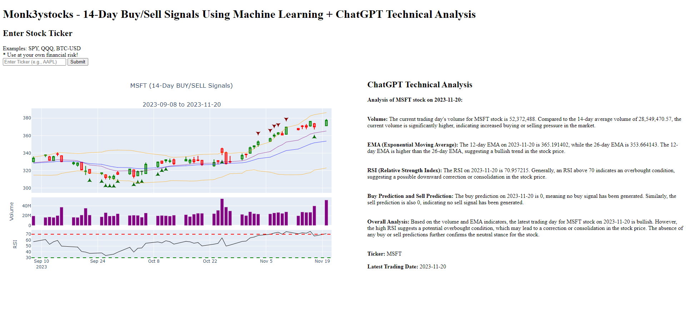

## Monk3yStocks App - Predicting Stocks Using Alternative and Technical Data + ChatGPT Technical Analysis

Try out the web app: [https://monk3ystocks.azurewebsites.net/](https://monk3ystocksazureapp.azurewebsites.net/)

**UPDATES**
- 11/20/2023: Added ChatGPT functionality for technical analysis using OpenAI's API. Current model: gpt-3.5-turbo
- 04/09/2023: Changed deployment to Azure App Services due to Heroku removing its free tier subscription. Note that Azure's free tier subscription has limited compute/day so app may not work with heavy users.

### App Preview - MSFT Stock with ML Signals and Technical Analysis by ChatGPT

### About
This personal project is a web application using Flask that allows users to view historical stock or crypto prices as candlestick charts with buying/selling trading signals generated from a machine learning model trained on alternative and technical data. ChatGPT was then used to provide technical analysis for the latest trading period. This application was containerized using Docker and is currently deployed on Azure App Services.

Note: The full code containing ChatGPT integration will not be shared (will be kept private), but feel free to contact me if you have any questions.

**DISCLAIMERS** 
- This trading app was made as a fun project for me to learn how to deploy interactive web apps and machine learning models using Docker and cloud app services.
- The full technical analysis of each stock was fully done 100% by ChatGPT through OpenAI's API. 
- Trade at your own risk. This app is not guaranteed to make you money.

### Data
#### Alternative Data
- Investor Survey Market Sentiment
- Big Mac Index
- Eurekahedge Hedge Fund Performances
- Misery Index (Unemployment Rate, Inflation Rate, Misery Index)

#### Technical Data
- Simple Moving Averages (50-day/200-day)
- Exponential Moving Averages (12-day/26-day)
- Relative Strength Indicator
- Moving Average Convergence/Divergence
- Upper and Lower Bollinger Bands
- Volume

### Machine Learning Models
- XGBoost Classifiers

### Library Dependencies
- Flask==3.0.0
- yfinance==0.2.31
- pandas-ta
- pandas==1.5.1
- numpy==1.23.4
- plotly==5.18.0
- joblib==1.2.0
- scikit-learn==1.1.2
- openai==1.3.3

### Trading Mantra
* **Control your emotions** - The most difficult thing about trading and investing is handling your emotions when decision-making. The worst thing you could do is enter a position solely based on emotion, for example, jumping into Bitcoin during its moon launch to $20,000 so that you don't get FOMO (Fear Of Missing Out). Being able to stay balanced mentally will allow you to think more rationally and become a better trader.
* **Be Prepared to Lose Sometimes** - Nobody wins 100% of the time, not even me. I've lost over $1000 in a single trading day, but the worst part wasn't losing the money, it was the negative after-effects it had on my mental health. Once I traded enough, I began to realize that I wasn't going to win all the time and that the best thing I could do after a loss is to prepare myself even better for the next trade.
* **Exercise and Eat Healthy** - Having a healthy diet and exercising improves how your brain functions allowing you to think more intelligently and rationally. Getting enough sleep is also crucial, especially if you're on the west coast when the market opens at 6:30AM. Just being healthy in general is good for the longevity and happiness of your overall life.
* **Take a Break** - Trading is like a marathon. You don't want to go all-in on the first lap and risk getting knocked out completely. Pace yourself mentally and physically. Have a hobby that isn't related to the stock market and is mentally challenging. This could be learning a new skill, playing an instrument, reading books, etc. Understand the importance of work-life balance.
* **Do Good Things** - Make an effort to help others whenever you can, whether it's donating, volunteering, or simply doing random acts of kindness. Having a positive mental mindset goes a long way and the attitude you have towards others will translate to the attitude you have around trading. Family, friends, and health are more important than money.
